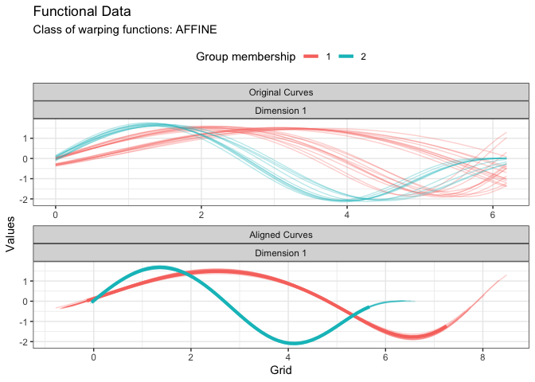
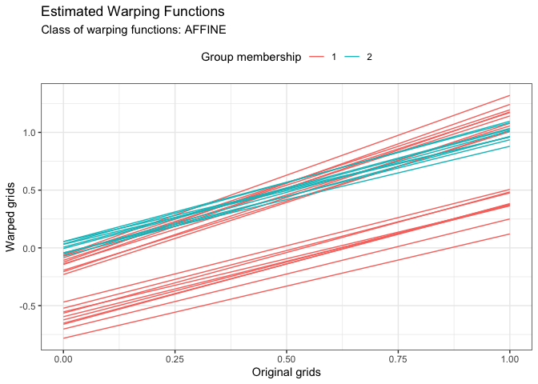

<!-- README.md is generated from README.Rmd. Please edit that file -->

# fdakma

<!-- badges: start -->

[](https://github.com/astamm/fdakma/actions/workflows/R-CMD-check.yaml)
<!-- badges: end -->

The **fdakma** package is only a wrapper around the faster and more
complete
[**fdacluster**](https://astamm.github.io/fdacluster/index.html)
package, which exposes the k-means alignment algorithm to the user. It
is mainly kept alive because it was advertised under this name when the
seminal paper was published. We strongly encourage R users to switch to
using the
[**fdacluster**](https://astamm.github.io/fdacluster/index.html) from
now on.

## Installation

You can install the development version of **fdakma** from
[GitHub](https://github.com/) with:

``` r
# install.packages("devtools")
devtools::install_github("astamm/fdakma")
```

## Example

``` r
library(fdakma)
#> ! The fdakma package is only a wrapper around the
#> faster and more complete fdacluster package, which exposes the k-means
#> alignment algorithm to the user. It is mainly kept alive because it was
#> advertised under this name when the seminal paper was published. We strongly
#> encourage R users to switch to using the fdacluster from now on.

res <- kma(
  fdacluster::simulated30$x,
  fdacluster::simulated30$y,
  seeds = c(1, 21),
  n_clust = 2,
  center_method = "medoid",
  warping_method = "affine",
  dissimilarity_method = "pearson"
)
#> Information about the data set:
#>  - Number of observations: 30
#>  - Number of dimensions: 1
#>  - Number of points: 200
#> 
#> Information about cluster initialization:
#>  - Number of clusters: 2
#>  - Initial seeds for cluster centers:          1        21
#> 
#> Information about the methods used within the algorithm:
#>  - Warping method: affine
#>  - Center method: medoid
#>  - Dissimilarity method: pearson
#>  - Optimization method: bobyqa
#> 
#> Information about warping parameter bounds:
#>  - Warping options:    0.1500   0.1500
#> 
#> Information about convergence criteria:
#>  - Maximum number of iterations: 100
#>  - Distance relative tolerance: 0.001
#> 
#> Information about parallelization setup:
#>  - Number of threads: 1
#>  - Parallel method: 0
#> 
#> Other information:
#>  - Use fence to robustify: 0
#>  - Check total dissimilarity: 1
#>  - Compute overall center: 0
#> 
#> Running k-centroid algorithm:
#>  - Iteration #1
#>    * Size of cluster #0: 20
#>    * Size of cluster #1: 10
#>  - Iteration #2
#>    * Size of cluster #0: 20
#>    * Size of cluster #1: 10
#> 
#> Active stopping criteria:
#>  - Memberships did not change.
```

``` r
plot(res, type = "data")
```



``` r
plot(res, type = "warping")
```


